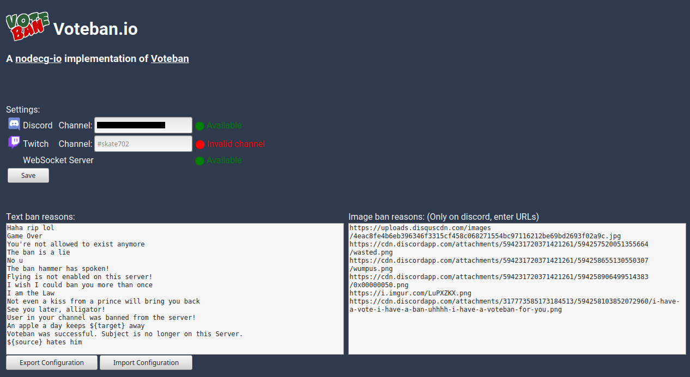

voteban-io is a [NodeCG](http://github.com/nodecg/nodecg) bundle. 
It works with NodeCG versions which satisfy this [semver](https://docs.npmjs.com/getting-started/semantic-versioning) range: `^1.1.1`
You will need to have an appropriate version of NodeCG installed to use it.

Documentation will follow. This is very WIP.

When building voteban-io you'll see two errors about `node_modules/nodecg-io-core/extension/persistenceManager.ts`. Ignore them.

The Ban reasons and images where copied from the original voteban-bot [here](https://github.com/joblo2213/Voteban)

And here's an image:

